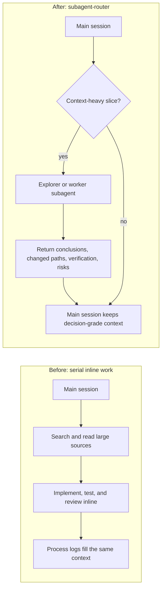
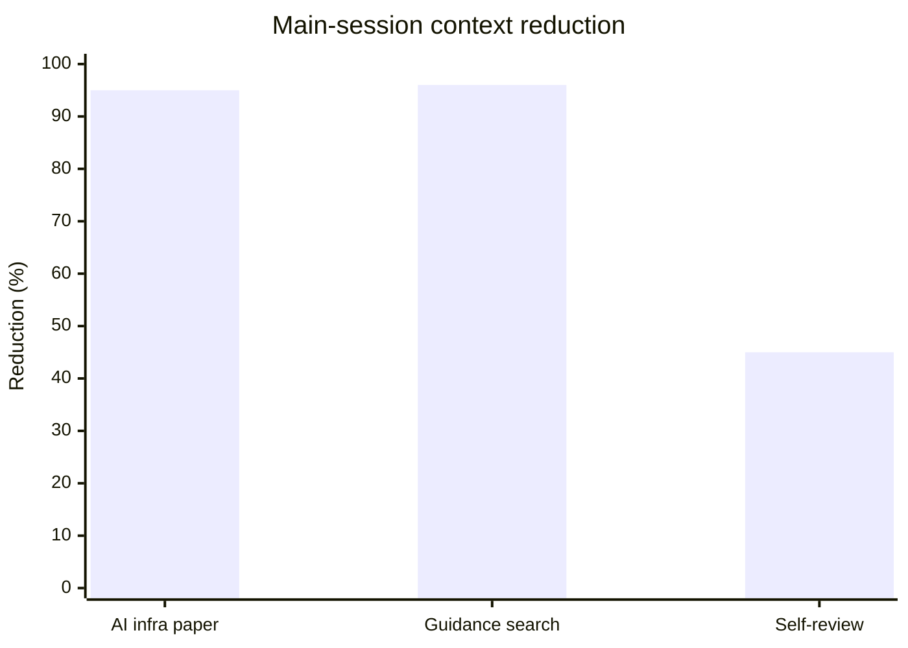

# Subagent Router

A lightweight Codex and Claude Code plugin that adds one skill:
`subagent-router`.

The skill helps the controller session stay small by routing suitable work to
isolated subagents. It is meant for multi-file changes, broad code search, test
triage, independent failures, review work, and `go on` style end-to-end
execution.

## Effect At A Glance

Local smoke tests showed the strongest benefit on large research, code-search,
and test-triage tasks. The measurements below estimate how much source material
stayed out of the controller session after work was routed through a subagent.
They are rough measurements, not a formal benchmark.

| Flow | Delegated material | Main-session return | Reduction |
| --- | ---: | ---: | ---: |
| AI infra paper | 25-page paper; about 16.7k words | Under 900 words | 94%-96% |
| Guidance search | 13 relevant docs; about 19.5k words | Under 700 words | About 96% |
| Plugin self-review | 4 files; about 1.1k words | Under 600 words | At least about 45% |

Small local edits or tiny repos will not show large context savings. The plugin
reduces main-session context, not necessarily total token usage. The guidance
search run started from a broader 154-file / 130.7k-word corpus; the table uses
the relevant document set as the comparison base.

### Before And After



### Data View



## What It Does

`subagent-router` teaches the assistant to check whether a task should be
delegated before doing context-heavy work inline.

It favors:

- `explorer` subagents for read-only codebase questions.
- `worker` subagents for bounded implementation, testing, and review tasks.
- Small, explicit subagent prompts with clear scope and return shape.
- Keeping only the result, changed files, verification, and risks in the main
  session.

It avoids delegation for single small edits, design questions that need user
judgment, shared file scopes, secrets, and high-risk global configuration.

## Install In Codex

Clone the plugin into the personal plugin location:

```bash
mkdir -p ~/plugins
git clone https://github.com/xxx1766/subagent-router.git ~/plugins/subagent-router
```

Make sure the personal marketplace file contains this plugin entry. In the
default personal marketplace, `./plugins/subagent-router` resolves to
`~/plugins/subagent-router`.

If the file already has other plugins, add the `subagent-router` object to the
existing `plugins` array rather than replacing the file.

```json
{
  "name": "personal",
  "interface": {
    "displayName": "Personal"
  },
  "plugins": [
    {
      "name": "subagent-router",
      "source": {
        "source": "local",
        "path": "./plugins/subagent-router"
      },
      "policy": {
        "installation": "AVAILABLE",
        "authentication": "ON_INSTALL"
      },
      "category": "Productivity"
    }
  ]
}
```

The default marketplace file is:

```text
~/.agents/plugins/marketplace.json
```

Then install the plugin:

```bash
codex plugin add subagent-router@personal
```

Start a new Codex session after installing so the skill list is refreshed.

### Verify In Codex

Check that the plugin is installed:

```bash
codex plugin list | rg 'subagent-router'
```

Expected output includes:

```text
subagent-router@personal  installed, enabled
```

Check that the skill appears in a new prompt context:

```bash
codex debug prompt-input 'test subagent router' | rg 'subagent-router'
```

Expected output includes a skill entry like:

```text
subagent-router:subagent-router
```

If the plugin is installed but the skill is not visible, start a new Codex
session. Skill lists are loaded at session start.

## Install In Claude Code

Validate the plugin:

```bash
claude plugin validate ~/plugins/subagent-router
```

Add a local checkout as a Claude Code marketplace:

```bash
claude plugin marketplace add ~/plugins/subagent-router
```

If the repository is accessible from the current environment, the GitHub URL
also works:

```bash
claude plugin marketplace add https://github.com/xxx1766/subagent-router
```

Install the plugin:

```bash
claude plugin install subagent-router@subagent-router
```

Start a new Claude Code session after installing so the skill list is
refreshed.

## Use

The skill metadata is intentionally written as the always-on short rule:

```text
Before any non-trivial task, consider whether subagents can keep the main
session small.
```

That metadata is present in the skill list at session start. The full
`SKILL.md` body is loaded only when the rule triggers.

For more reliable behavior across projects, add this short rule to your
persistent instructions file. Use `AGENTS.md` for Codex and `CLAUDE.md` or
`.claude/rules/subagent-router.md` for Claude Code:

```md
Before any non-trivial task, consider whether the installed `subagent-router`
skill should handle context-heavy work through subagents.

Use it for broad search, multi-file changes, test triage, review work,
independent failure investigation, and `go on` style end-to-end execution. Keep
single small edits and design questions inline.
```

The skill can also trigger implicitly when a task mentions subagents,
delegation, parallel search, multi-file changes, unrelated failures, tests,
reviews, or `go on`.

You can also invoke it explicitly:

```text
Use $subagent-router while working on this task.
```

Good trigger examples:

```text
Go on: implement the next useful fix, test it, commit it, and push.
```

```text
Find where this API is used and summarize the relevant call sites.
```

```text
Several unrelated test files are failing. Split the investigation cleanly.
```

Example dispatch shape:

```text
User: Find where this API is used and summarize the relevant call sites.
Main session: delegate broad search to an explorer.
Explorer prompt: inspect call sites, stay read-only, return only relevant files,
behavior summary, and risks.
Main session keeps: the call-site list and the conclusion, not the full search
process.
```

### Trigger Matrix

| Situation | Route |
| --- | --- |
| Broad read-only search where only conclusions matter | Delegate to `explorer` |
| Multi-file implementation with clear ownership boundaries | Delegate bounded slices to `worker` |
| Unrelated test failures across files or subsystems | Split by independent failure domain |
| Single small local edit | Keep inline |
| Design question needing user judgment | Keep inline and ask/answer in main session |
| Secrets, global config, MCP/harness settings | Keep inline unless explicitly authorized |
| Two agents would edit the same files | Do not parallelize that slice |

## Notes

This plugin does not require Ruflo, MCP setup, or hook configuration. It is a
skill-level routing rule for native subagent capability in Codex or Claude
Code.

It is most useful on surfaces that expose subagent tools. If a surface does not
expose subagents, the skill still works as a routing checklist, but it cannot
create isolated worker sessions by itself.

Hooks or MCP orchestration can be added later, but the first version stays
small on purpose: it reminds the main session to delegate at the right time
without adding another runtime.

`skills/subagent-router/agents/openai.yaml` is UI metadata for Codex skill
discovery. The behavior lives in `skills/subagent-router/SKILL.md`.

Subagents reduce main-session context, not necessarily total token usage. The
controller still needs to review subagent results and run final verification
before claiming completion.
